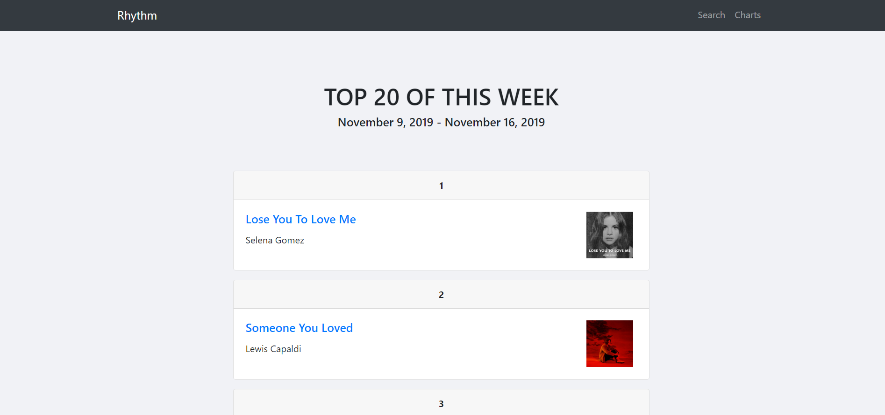

# Rhythm

Rhythm is a web application built with Flask centered around music. The goal of this project was to create an application that would use my Spotify API Wrapper, [easy-spotify](https://github.com/OktarianTB/easy_spotify). The application displays the latest music charts scraped from Billboard and then uses my wrapper to get information about each track. Additionally, users can search for a specific track or artist. The application includes pages for artists and songs. The images, related artists and top tracks are obtained using the wrapper. Finally, each song page also displays an interactive visualization of the song's audio features using Bokeh.

This was a fun project that allowed me to test my wrapper as well as gain more experience using Flask and discovering Bokeh. I hope you like it!
&nbsp;
### Youtube Demo Video:
You can watch a live demonstration here: [Video](https://www.youtube.com/watch?v=kGQE0yUvWno&feature=youtu.be)
### Some screenshots:

&nbsp;

&nbsp;

&nbsp;

